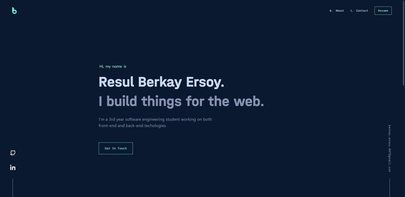

<p align="center" style="margin-bottom:30px;margin-top:20px"></p>

# <div align="center" style="text-decoration:none"><span></span>https://berkayersoy.netlify.app v1</div>


<div align="center" style="margin-bottom:20px">

<span></span>https://berkayersoy.netlify.app/ built with [Angular](https://angular.io/)
</div>


<p align="center"></p>

</br></br>

# 🚀 Building and Running for Production

1. Generate a full static production build  </br>

    ```
    npm run build
    ```
2. Preview the site as it will appear once deployed </br>

    ```
    npm run serve
    ```